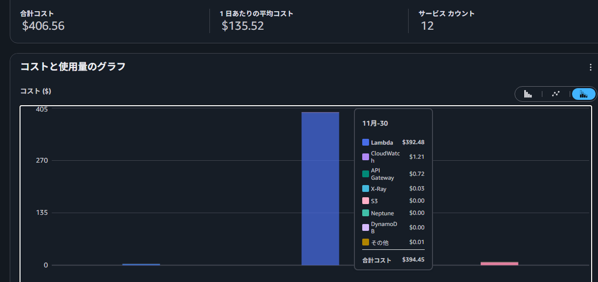
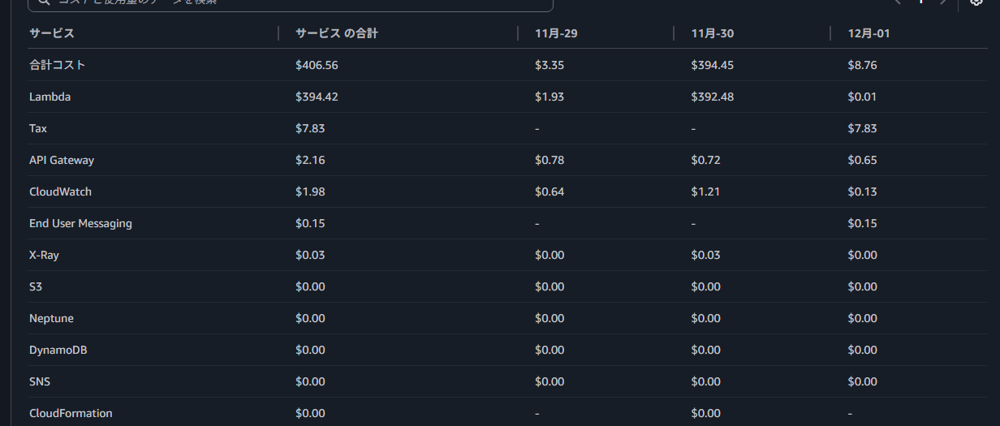

# AWSでやらかした話。

これは
[防災アプリ開発　Advent Calendar 2025](https://adventar.org/calendars/11308)の17日目
[gakuseibot Advent Calendar 2025](https://qiita.com/advent-calendar/2025/gakuseibot)の18日目
の記事です。

## 自己紹介
初めまして、現在大学生の孤独のコーヒーと申します。
今年から大学生となり、かなり忙しい日々を送っており今年はほぼ他の方と比べて大きく「こんなことをしたぞぉ！」っていうのは少ないのですが、、表題にある通りにやらかしてしまい供養と戒めのためにも1日約400ドル（請求時日本円で75000円ほど）請求された話でも、、


## BOTについて

運営しているDPI-BotはDiscordのWebhookを利用し、地震情報や津波情報や気象警報・注意報や気象情報などの気象関連などなど気象庁から発表される情報を配信しています。詳細はこちらから
これらの配信する上で迅速性が求められる情報が多くできるだけ早く、かつ大量の情報を配信したいのですが、webhookには荒らしなどの対策でレート制限が存在します


###　レート制限
Discordからドキュメントとして一応記事は出ているものの、様々な条件などが存在するため、参考程度に、
同IPから5req/s または同チャンネルに30req/m以上送信で制限が掛かるらしく、2023年末までは配信数も少なかったため、自宅サーバーより配信していましたが2024年正月の石川県での大地震により配信数が急増し、この制限にやられほぼ1日配信できない状況となり、急遽ＡＷＳへ移行する形となりました。この移行に関しては下記記事をご覧ください！（露骨な宣伝(())
[気象・地震情報などをAWSからWebhookで配信している話](https://qiita.com/jr226/items/9656bcde6efca862f243)
なぜ、ＡＷＳを利用しているのかに関してですが、結論から話すとlambdaを利用し配信しており、このlambdaのIPアドレスは一定時間などで変更（ローテーション）されるため、万が一制限を食らったとしても、次回配信するときに影響がないからです。

##  やっと本題
ではなぜ、そんなAWSから高額請求をされてしまったのか、それはある機能をONにしてしまったからです。
さてそのある機能とは、AWSを普段利用している人ならlambdaを利用している。迅速性を求めている。からもしかしたらお気づきかもしれませんが、、それはProvisioned Concurrency(プロビジョニングされた同時実行)の設定をONにしてしまったからです。
このProvisioned Concurrencyとはなんなのか、その前に簡単にlambdaについて説明します。
### Lambdaについて
AWSより「サーバレスコンピューティングAWS　Lambda。サーバーやクラスタについて検討することなくコードを実行。」[引用記事](https://aws.amazon.com/jp/pm/lambda/?trk=065f9330-e033-4770-bfd7-4af000a338f2&sc_channel=ps&trk=065f9330-e033-4770-bfd7-4af000a338f2&sc_channel=ps&ef_id=CjwKCAiAmKnKBhBrEiwAaqAnZyktygxZRYMbW2nT0xnxtyx-gJ3wWFa0lCOQgZENKfIJBvB9waNlCBoCzBIQAvD_BwE:G:s&s_kwcid=AL!4422!3!785483253781!e!!g!!aws%20lambda&gad_campaignid=23300619076&gbraid=0AAAAADjHtp-yfkelCNoJ2YsoF6UQfnVNk&gclid=CjwKCAiAmKnKBhBrEiwAaqAnZyktygxZRYMbW2nT0xnxtyx-gJ3wWFa0lCOQgZENKfIJBvB9waNlCBoCzBIQAvD_BwE)
とあるように、サーバレスでコードを実行できる便利な機能なのですが、Lambdaはイベント発生時、つまり呼び出されたときのみに実行されるため、使用されたに間は一切リソースが消費されません。そのためコスト的にはいいものの、同時に「コールドスタート」と呼ばれる問題が発生します。
このコールドスタートとは、2つの時に発生します。
・プログラムを新規新規または更新されて最初に実行されるとき
・長時間使用されたなかった時に実行されたとき
上記の条件の場合にlambda側は実行環境の準備やランタイムの初期化、lambda関数コードのロードが挟まるため遅延が発生します。
そこでProvisioned Concurrencyを使うことで常に事前に初期化して待機状態にすることで上記のコールドスタート対策となります。

### Provisioned Concurrency
さて、Provisioned Concurrencyを語るうえで前提知識が長くなってしまったのですが、このProvisioned Concurrencyを設定したことによりAWSより高額請求を受ける羽目になりましたが、なぜこのようなことになってしまったのか、、それは単純**調べ不足**です。当時の私はとにかく迅速性を求め過ぎたことで料金を調べるに設定しまったのです。
ＡＷＳより料金についてこのような式が公開されており。
`合計料金= Provisioned Concurrency料金+リクエスト料金+コンピューティング料金`
となっており、Provisioned Concurrency料金は　1GB/s あたり　0.0000053835USD と東京リージョンでは設定されており、
仮に実行合計時間（月）を1時間。Lambdaに割りてたメモリを10240MB(10GB)とすると
```
1h= 3600s 
10240Mb = 10GB
Provisioned Concurrency料金 = 1000(割り当て最大実行数)　* 3600 * 10 * 0.0000053835 = 193.81USD
```
コンピューティング料金が
```
100req * 50s = 5000
10GB * 5000s = 50000 Gb-s 
50000 * 0.0000125615 = 0.63 USD
 ```
となり、リクエスト料金に関しては切り上げにより0USDなので

合計が
`
 193.81 + 0.63 = 194.44USD
`
となります。はい仮の料金ですがおっそろしいですね。
そしてこれは**Lambda1つに対しての料金です。**


## 悪夢の日
私はこのProvisioned Concurrencyを126個のLambdaで設定をしてしまいました。
もちろん料金のことを忘れているわけなく、設定後数時間は逐一確認していましたが、、
AWSくん。コスト料金を確認できるのは翌日または翌々日なんですよね。。
そして確認した12月2日最後寝る前に、、と確認したら、、


明らかにおかしいやつがいます。
たった一日で400ドルです。
もう一度言います。たった1日で400ドルです。逆によく1日で止めれたと感心しています。
当時高校3年生の自分の心境を想像するとさぞかし、死にたくなったでしょう、、、、、

### とりあえず設定ＯＦＦ！

当時ド深夜の12月2日（正確には3日）の午前2時頃にとりあえずすべて設定をOFFに、、としかし設定したの126個あるためすべてOFFにするのも30分～1時間ほどかかり、二重、三重で設定がオフになっていることを確認しました。
そして確認後頭をよぎったのは払えない！！！！
親に土下座して、払ってもらうか？。しかしあまり自分の事に理解を示さない親のため説明しても無理！ってなるのが明白でした。借金するか？などなど調べているうちに。同じような記事を見つけたのです。そして連絡すれば**もしかしたらチャラにできるかも**
深夜3時にこの記事を見つけたときは安堵と同時にＡＷＳ様を神様と感じたでしょうｗ
速攻サポートに連絡し、英語のほうが早いということで日本語と英語の同時で返信待ちをしていました。しかし
この記事を見つけ、安心したのか突然の眠気に襲われ、ＰＣの前で寝落ちしてしまったのを覚えています。
いくら北海道でも12月です。寒いので5、6時ぐらいに起きてしまい、そのまま高校へ、、、

## 突然の請求
記事を見つけ、安堵した自分。しかし高校の授業中一つのメールが、、ＡＷＳからの請求です。
すっかり忘れていました。請求は翌月2日、3日に来るのです。
高校生のため親からクレカの許可がおりず、プリペイド式のカードを使用していたため、請求失敗のメールでした。
運がいいのか、わるいのかはおいておきますｗ
### サポートからの連絡
ちょうど連絡はAWSより連絡し、意図的ではないこと、こちらに落ち度しかないことを説明を説明すると、予防策などなどをしろとの指示を受けたため、一定料金を超過するとアラート設定などを行いました。
そして、請求額の調整を行うとの連絡が決ました！
連絡中は1時間から2時間ほどで返信がくるため、いろいろ連絡などを行っていたため、最終的に調整についてきたのは12月6日でした。この間請求はずっとできないよう（残高不足にして）にしていたため、ＡＷＳ自体の利用を止められないがが心配でしたが止められることなく、無事使用した料金分の補填分が反映され、残りは指定口座に振り込みを行い、この幕が閉じられました。

### 対策
さて、高額請求の幕を閉じましたが、もちろん今後はAWSも甘くないです。
そこで基本中の基本ですが対策を講じました。
**・新機能や機能を変更する場合はよく調べてから行う！**
当たり前かもしれませんが、当時、一つのことしかなく突っ走って行った結果がこれです。
なので、よく調べて、AIなどを駆使してコスト料金が高額または意図しない料金が発生しないかなどやアクセス過多時など考えられることを想定し、コスト面が高額にならない構築をするようにしています。

**・アラートを付ける**
一定料金のアラートをを複数つけることで、普段の料金より超過している場合にすぐ気づけるように、
そしてコスト予測アラートを付けることでより、高額請求を防げるようにしました。

根本的なことですが、とても大事なことだと思っています。
現在では毎日寝る前にコストを見るのがルーティンとなっていますｗ。

## まとめ
この記事を読んでいる方はＡＷＳを利用またはなんとなく理解している方もいらっしゃるでしょう。
なのでこの記事を読んで、バカなことをしているな～ぐらい思っているでしょう。
思ってくれるだけでいいです。このバカで反面教師となり、こんな失敗しないようにしてください。
個人事業主などなら自分の財布などがさみしくなるだけですが、これが会社と考えるとおっそろしいです。

以上、ＡＷＳでやらかした話でした。
17日目なのに全く記事公開できず申し訳ないです。バイトやテストなどが重なってしまい、全くかけずに、、、
年末年始もバイトなので世の中回さないと行けないので、今日しかねぇ！！！と本気で3時間ほどで書いているので誤字・脱字や読みずらい箇所など大量にあるでしょう、、、温かい目で見てください！
ここまで読んでくれてありがとうございました！！！


## 余談
このＢＯＴに関してのアンケートを実施しています。
利用している方や今後利用したいと思っている方向けです。
今後の開発の参考にいたしますので、ぜひご協力をお願いします。
[アンケートのお願い](https://forms.gle/5ZVRUMphvCcKh6zo9)


:::note info
学生のバイトでこのBOTの維持、運営を行っております。
今後継続していくうえで無理のない範囲でサポートしていただける方がいらっしゃいましたら
下記リンクよりお願いいたします。
[寄付について](../site/buy/index.html)
:::